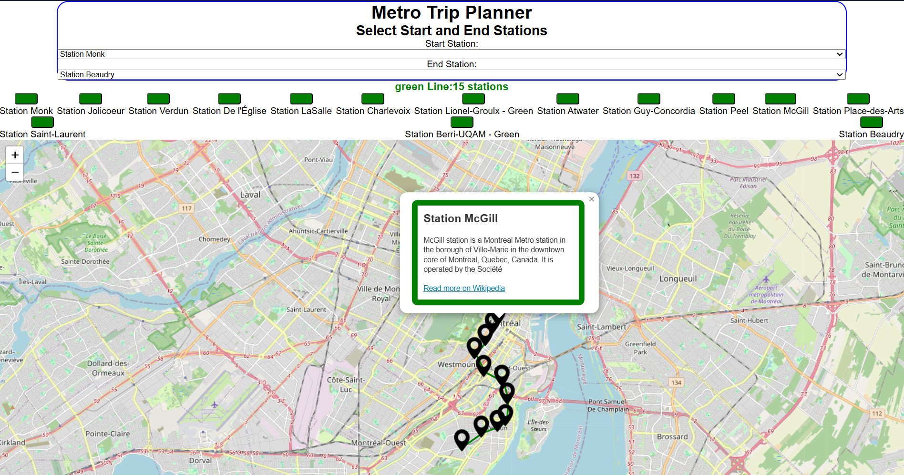

# A2 Metro Trip Planner Afsana Khayer

## Requirements

There should be a client and server side. Reading from geojson file and parsing it. The route should be indicated on the map with markers and with routeblocks. Clicking on a marker should make the associated button get bigger and the buttons should get bigger on hover.

Express + React app

Description:
The website should allow the user to create a trip planner based on which station they want to start at and where to end. The website should use the stm stops geojson file, parse it and use that list to display the correct stations. When the client clicks on a marker it should allow them to see the wikipedia definition of the station and access the wiki page.

## Screenshot


## Structure

There are two directories in the **root** of the project.

- The Express server is in `server/`
- The React app is in `metro-client/
- The server responds to API calls and serves the **built** React app.

There are 3 package.json files -- see what `scripts` they define.

## Setup

To install all the dependencies and build the React app run:

```
npm run build
```

## To run the app

npm run dev to open the client side and node --watch server/api.mjs on two different terminals on vscode then open http://localhost:5173/ to visit the website!

### Just the client

```
cd metro-client
npm run dev
```

### Just the server

```
node --watch server/api.mjs
```

### Client and Server

```
npm run build
npm run start
```

## Known bugs / missing features

I fetch from wikipedia multiple times and that could overload the server if there were a lot of stations. Instead of fetching for all the station in the route I could just fetch for the popup that is clicked.
I was planning on implementing the multi-line feature but i didnt have any time with my other midterms.
If the wikipedia link is wrong the website will crash.

## Component Hierarchy 
App
├── DropDownStations (Start Station)
├── DropDownStations (End Station)
├── RouteBlocks
│   └── (renders route station blocks)
└── MapExample
    └── MetroMarkers
        ├── Marker (Leaflet)
        │   └── Popup
        └── Polyline

## Sources
Jaya's lectures, examples and exerices.
Assignment 1

Open Data STM (Société de transport de Montréal):
Metro station data (names, coordinates, routes) obtained from the STM Open Data Portal.
https://www.stm.info/en/about/developers

Leaflet & React-Leaflet:
Used for displaying interactive maps and markers.
https://leafletjs.com/

https://react-leaflet.js.org/

Marker Icon:
Default Leaflet marker image used from Leaflet’s assets.

Wikipedia API:
Used to fetch descriptions of metro stations.
https://www.mediawiki.org/wiki/API:Main_page
